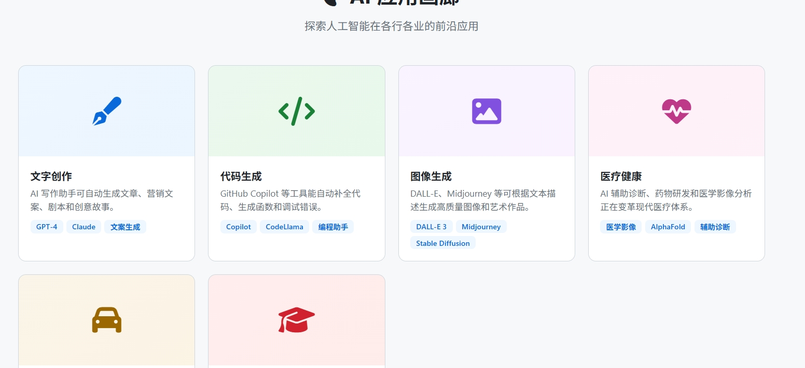

# AI 科普百科

一个完全自包含的单文件 HTML 人工智能百科全书网站，提供全面的 AI 知识介绍。无需后端或外部构建工具，直接在浏览器中打开即可使用。



## 功能特性

- **完全自包含** - 单个 HTML 文件，包含所有 CSS、JavaScript 和内容
- **零依赖** - 无需 Node.js、无需构建工具
- **深色/浅色主题** - 一键切换，支持系统偏好
- **全文搜索** - 快速搜索 AI 相关知识
- **响应式设计** - 完美适配桌面端和移动端
- **粒子动画** - Hero 区域炫酷的 Canvas 粒子背景
- **卡片式布局** - 美观的知识展示卡片
- **时间线** - AI 发展历史可视化
- **返回顶部** - 一键回到页面顶部

## 技术栈

| 技术 | 说明 |
|------|------|
| HTML5 | 页面结构 + Canvas 粒子动画 |
| CSS3 | 样式、动画、深色/浅色主题 |
| Vanilla JavaScript | 交互逻辑（无框架依赖） |
| Font Awesome | 图标库（CDN） |

## 内容板块

### 🧠 AI 知识体系 (`#knowledge`)
涵盖人工智能核心知识领域的分类卡片，包括：
- 机器学习
- 深度学习
- 自然语言处理
- 计算机视觉
- 强化学习
- 机器人技术

### 💡 核心概念 (`#concepts`)
AI 领域重要概念的详细解释：
- 神经网络
- 卷积神经网络 (CNN)
- 循环神经网络 (RNN)
- Transformer
- 生成对抗网络 (GAN)
- 迁移学习

### 📅 发展时间线 (`#timeline`)
人工智能发展历史的重要里程碑：
- 1950s - AI 概念诞生
- 1997 - 深蓝击败国际象棋冠军
- 2012 - 深度学习突破
- 2016 - AlphaGo 击败围棋冠军
- 2022 - ChatGPT 发布
- 2023+ - 大模型时代

### 🖼️ 应用展示 (`#gallery`)
AI 在各领域的实际应用案例。

### 📰 最新动态 (`#news`)
AI 领域的最新发展和新闻。

## 使用方式

直接在浏览器中打开 `index.html` 文件即可：

```bash
# Windows
start index.html

# macOS
open index.html

# Linux
xdg-open index.html
```

## 项目结构

```
ai-encyclopedia/
├── index.html                    # 完整网站（单文件，约 32KB）
├── 微信截图_20260512230247.png   # 截图预览
└── README.md
```

## 浏览器兼容性

| 浏览器 | 支持 |
|--------|------|
| Chrome 90+ | ✅ |
| Firefox 88+ | ✅ |
| Safari 14+ | ✅ |
| Edge 90+ | ✅ |

## 适用场景

- AI 知识学习与入门
- 离线环境下的人工智能资料查阅
- 教学演示与科普展示
- 快速部署（无需服务器）

## License

MIT
